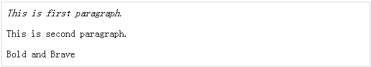
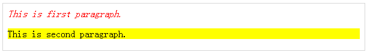

# jQuery - 属性

当谈到 DOM 元素时，我们可以操作的一些最基本的组件是属性以及分配给这些元素的属性。

大部分属性可以作为 DOM 节点属性在 JavaScript 中时可用的。一些比较常见的属性是 ——

- 类名

- 标签名

- id

- 超链接

- 标题

- rel

- src

考虑下述一个图像元素的 HTML 标记 ——

``` 

```

在这个元素的标记中，标签名是 img，并且为 id，src，alt，类以及标题的标记代表了元素的属性，每一个都包含一个名称和一个值。

jQuery 提供给我们的方法很容易操纵元素的属性并且我们可以访问元素，这样我们也可以改变其属性。

## 获取属性值

**attr()** 方法可以用来获取与设置匹配的第一个元素的一个属性的值或对所有匹配的元素设置属性值。

### 示例

下面是一个简单的例子，用于获取 < em> 标签的标题属性并且用相同的值来设置 < div id="divid"> 的值 ——

``` 
<html>
   <head>
      <title>The jQuery Example</title>
      <script type="text/javascript" src="http://ajax.googleapis.com/ajax/libs/jquery/2.1.3/jquery.min.js">
      </script>
		
      <script type="text/javascript" language="javascript">
         $(document).ready(function() {
            var title = $("em").attr("title");
            $("#divid").text(title);
         });
      </script>
   </head>
	
   <body>
      <div>
         <em title="Bold and Brave">This is first paragraph.</em>
         <p id="myid">This is second paragraph.</p>
         <div id="divid"></div>
      </div>
   </body>
	
</html>
```

这将产生如下所示结果 ——



## 设置属性值
 
**attr(name, value)** 方法使用传递的值，用于给包装好的集合中的全部元素设置指定的属性。

### 示例

下述是一个简单的例子，用于将图像标签的 **src** 属性设置到一个正确的位置 ——

``` 
<html>
   <head>
      <title>The jQuery Example</title>
      <script type="text/javascript" src="http://ajax.googleapis.com/ajax/libs/jquery/2.1.3/jquery.min.js">
      </script>
		
      <script type="text/javascript" language="javascript">
         $(document).ready(function() {
            $("#myimg").attr("src", "/images/jquery.jpg");
         });
      </script>
   </head>
	
   <body>
      <div>
         
      </div>
   </body>
	
</html>
```

这将产生如下所示结果 ——


## 应用样式

**addClass( classes )** 方法可用于将定义好的样式表应用到全部可匹配的元素中。你可以指定由空间隔开的多个类。

### 示例

下面是一个简单的例子，设置了段落 < p> 标签的 **class** 属性 ——

``` 
<html>
   <head>
      <title>The jQuery Example</title>
      <script type="text/javascript" src="http://ajax.googleapis.com/ajax/libs/jquery/2.1.3/jquery.min.js">
      </script>
		
      <script type="text/javascript" language="javascript">
         $(document).ready(function() {
            $("em").addClass("selected");
            $("#myid").addClass("highlight");
         });
      </script>
		
      <style>
         .selected { color:red; }
         .highlight { background:yellow; }
      </style>
		
   </head>
	
   <body>
      <em title="Bold and Brave">This is first paragraph.</em>
      <p id="myid">This is second paragraph.</p>
   </body>
	
</html>
```

这将产生如下所示结果 ——



## 属性方法

下表列出了一些有用的方法，你可以使用这些方法对多个属性进行操作 ——

<table class="table table-bordered">
<tr>
<th>序号</th>
<th>方法 &amp; 描述</th>
</tr>
<tr>
<td>1</td>
<td><b>attr( properties )</b>
<p>设置键/值对象作为全部可匹配的元素的属性。</p></td>
</tr>
<tr>
<td>2</td>
<td><b>attr( key, fn )</b>
<p>为所有可匹配的元素设置一个单个的属性为可计算的值。</p></td>
</tr>
<tr>
<td>3</td>
<td><b>removeAttr( name )</b>
<p>从每一个可匹配的元素中删除一个属性。</p></td>
</tr>
<tr>
<td>4</td>
<td><b>hasClass( class )</b>
<p>如果指定的类出现在至少一个可匹配的元素集合中，返回 true。</p></td>
</tr>
<tr>
<td>5</td>
<td><b>removeClass( class )</b>
<p>从可匹配的元素集合中删除全部或指定的类。</p></td>
</tr>
<tr>
<td>6</td>
<td><b>toggleClass( class )</b>
<p>如果指定的类不存在，那么添加指定的类；如果指定的类存在，那么删除它。</p></td>
</tr>
<tr>
<td>7</td>
<td><b>html( )</b>
<p>获取第一个匹配元素的 html 内容 (innerHTML)。</p></td>
</tr>
<tr>
<td>8</td>
<td><b>html( val )></b>
<p>设置每一个可匹配元素的 html 内容。</p></td>
</tr>
<tr>
<td>9</td>
<td><b>text( )</b>
<p>获取所有可匹配元素的组合的文本内容。</p></td>
</tr>
<tr>
<td>10</td>
<td><b>text( val )</b>
<p>设置所有可匹配元素的文本内容。</p></td>
</tr>
<tr>
<td>11</td>
<td><b>val( )</b>
<p>获取第一个可匹配元素的输入值。</p></td>
</tr>
<tr>
<td>12</td>
<td><b>val( val )</b>
<p>如果可匹配元素在 &lt;input&gt; 中调用，那么设置每个可匹配元素的属性值，但是如果可匹配元素在 &lt;select&gt; 中使用传递的 &lt;option&gt; 值调用，那么传递的选项就会被选中，如果可匹配元素在复选框或单选框中调用，那么所有匹配的复选框或单选框会被选中。</p></td>
</tr>
</table>

### 示例

与上述语法和示例相似，下述例子会使你对在不同的情况下使用不同的属性方法有一个很好地了解 ——

<table class="table table-bordered">
<tr>
<th>序号</th>
<th>选择器 &amp; 描述</th>
</tr>
<tr>
<td>1</td>
<td><b>$("#myID").attr("custom")</b>
<p>这会为第一个与 ID myID 匹配的元素返回属性 <i>custom</i> 的值。</p></td>
</tr>
<tr>
<td>2</td>
<td><b>$("img").attr("alt", "Sample Image")</b> 
<p>这会将所有图像的 <b>alt</b> 属性设置为一个新的值 "Sample Image".</p></td>
</tr>
<tr>
<td>3</td>
<td><b>$("input").attr({ value: "", title: "Please enter a value" });</b>
<p>将所有的 &lt;input&gt; 元素设置为空字符串，同时将 The jQuery Example 设置为字符串 <i>Please enter a value</i>.</p></td>
</tr>
<tr>
<td>4</td>
<td><b>$("a[href^=http://]").attr("target","_blank")</b>
<p>选择带有以 <i>http://</i> 开头的 href 属性的全部链接并且将它的 target 属性设置为 <i>_blank</i>.</p></td>
</tr>
<tr>
<td>5</td>
<td><b>$("a").removeAttr("target")</b>
<p>这将删除所有链接中的 <i>target</i> 属性。</p></td>
</tr>
<tr>
<td>6</td>
<td><b>$("form").submit(function() {$(":submit",this).attr("disabled", "disabled");});</b>
<p>点击提交按钮时，它会把不可用的属性修改为值 "disabled" 。</p></td>
</tr>
<tr>
<td>7</td>
<td><b>$("p:last").hasClass("selected")</b>
<p>如果最后一个 &lt;p&gt; 标签有关联类 <i>selected</i>，返回 true。</p></td>
</tr>
<tr>
<td>8</td>
<td><b>$("p").text()</b>
<p>返回包含与 &lt;p&gt; 元素匹配的组合的文本内容的字符串。.</p></td>
</tr>
<tr>
<td>9</td>
<td><b>$("p").text("&lt;i&gt;Hello World&lt;/i&gt;")</b>
<p>设置 "&lt;I&gt;Hello World&lt;/I&gt;" 为与  &lt;p&gt; 元素匹配的文本内容。</p></td>
</tr>
<tr>
<td>10</td>
<td><b>$("p").html()</b>
<p>返回所有匹配的段落的 HTML 内容。</p></td>
</tr>
<tr>
<td>11</td>
<td><b>$("div").html("Hello World")</b>
<p>设置与 &lt;div&gt; 匹配的 HTML 内容为 <i>Hello World</i>。</p></td>
</tr>
<tr>
<td>12</td>
<td><b>$("input:checkbox:checked").val()</b>
<p>从已选取的复选框中获取第一个值。</p></td>
</tr>
<tr>
<td>13</td>
<td><b>$("input:radio[name=bar]:checked").val()</b>
<p>从一组单选按钮中获取第一个值。</p></td>
</tr>
<tr>
<td>14</td>
<td><b>$("button").val("Hello")</b>
<p>设置每一个与 &lt;button&gt; 匹配的元素的属性值。</p></td>
</tr>
<tr>
<td>15</td>
<td><b>$("input").val("on")</b>
<p>这会检查所有值为 "on" 的单选或复选框按钮。</p></td>
</tr>
<tr>
<td>16</td>
<td><b>$("select").val("Orange")</b>
<p>这会在下拉框为橙子，芒果和香蕉的选项中选择橙子。</p></td>
</tr>
<tr>
<td>17</td>
<td><b>$("select").val("Orange", "Mango")</b>
<p>这会在下拉框为橙子，芒果和香蕉的选项中选择橙子和芒果。</p></td>
</tr>
</table>

