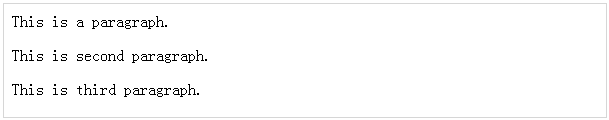

# jQuery - 基础知识

jQuery 是一个使用 JavaScript 构建的框架。因此，尽管使用 jQuery 开发应用程序，你也可以使用 JavaScript 中所有可用的函数和其他功能。

本节将解释基于 jQuery 的应用程序中最基本的但经常使用的概念。

## 字符串

字符串在 JavaScript 中是一个不可变的对象，包括 0 个、一个或多个字符。

以下是 JavaScript 字符串的正确的例子 ——

``` 
"This is JavaScript String"
'This is JavaScript String'
'This is "really" a JavaScript String'
"This is 'really' a JavaScript String"
```

## 数字

数字在 JavaScript 中是 64 位格式 IEEE 754 双精度值。它们和字符串一样，也是不可变的。

以下是 JavaScript 数字的正确的例子 ——

``` 
5350
120.27
0.26
```

## 布尔值

JavaScript 中布尔值是 **true** 或者 **false**。如果一个数字是 0，它默认为 false。如果一个字符串为空，它也默认为 false ——

以下是 JavaScript 布尔值的正确的例子 ——

``` 
true      // true
false     // false
0         // false
1         // true
""        // false
"hello"   // true
``` 

## 对象

JavaScript 同样也支持对象的概念。你可以使用对象文字创建一个对象，如下所示 ——

``` 
var emp = {
   name: "Zara",
   age: 10
};
```

你也可以使用点符号来读或写属性，如下所示 ——

``` 
// Getting object properties
emp.name  // ==> Zara
emp.age   // ==> 10

// Setting object properties
emp.name = "Daisy"  // <== Daisy
emp.age  =  20      // <== 20
```

## 数组

你可以使用数组文字定义数组，如下所示 ——

``` 
var x = [];
var y = [1, 2, 3, 4, 5];
```

数组有 **length** 属性，这对迭代是非常有用的 ——

``` 
var x = [1, 2, 3, 4, 5];
for (var i = 0; i < x.length; i++) {
   // Do something with x[i]
}
```

## 函数

在 JavaScript 中的函数可以是命名的或匿名的。命名函数可以使用 *function* 关键字定义，如下所示 ——

``` 
function named(){
   // do some stuff here
}
```

匿名函数可以用定义正常函数一样的方式定义，但它不会有任何的名字。

匿名函数可以被分配给一个变量或传递给一个方法，如下所示。

``` 
var handler = function (){
   // do some stuff here
}
```

jQuery 会频繁使用匿名函数，如下所示 ——

``` 
$(document).ready(function(){
   // do some stuff here
});
```

## 参数

JavaScript 变量 *arguments* 是一种带有长度属性的数组。下面的例子会很好的解释这一点 ——

``` 
function func(x){
   console.log(typeof x, arguments.length);
}
func();                //==> "undefined", 0
func(1);               //==> "number", 1
func("1", "2", "3");   //==> "string", 3
```

参数对象也有 *callee* 属性，指向内部函数。例如 ——

``` 
function func() {
   return arguments.callee; 
}
func();                // ==> func
```

## 上下文

JavaScript 著名的关键字 **this** 总是指当前上下文。在一个函数中，**this** 上下文可以改变，这取决于函数调用的方式 ——

``` 
$(document).ready(function() {
   // this refers to window.document
});

$("div").click(function() {
   // this refers to a div DOM element
});
``` 

你可以使用函数内置的方法 **call()** 和 **apply()** 为函数调用指定上下文。

这两种方法之间的区别是它们传递参数的方式。Call 方法通过将所有参数作为参数传递给函数，而 apply 方法只接受数组作为参数。

``` 
function scope() {
   console.log(this, arguments.length);
}

scope() // window, 0
scope.call("foobar", [1,2]);  //==> "foobar", 1
scope.apply("foobar", [1,2]); //==> "foobar", 2
```

## 作用域

一个变量的作用域是该变量所在的程序的定义的范围。JavaScript 变量将只有两个作用域。

- **全局变量 ——** 全局变量有全局作用域，意味着它可以被定义在 JavaScript 代码中的任何位置。

- **局部变量 ——** 局部变量只能在该变量被定义的函数中可见。函数的参数对该函数来说是局部的。

在一个函数体中，同名的局部变量优先于全局变量 ——

``` 
var myVar = "global";     // ==> Declare a global variable

function ( ) {
   var myVar = "local";   // ==> Declare a local variable
   document.write(myVar); // ==> local
}
``` 

## 回调

回调是一个简单的 JavaScript 函数，作为参数或选择传递给一些方法。一些回调就是事件，当触发某种状态时，给用户做出反应的机会，就会调用回调。

jQuery 的事件系统会在任何位置使用回调，例如 ——

``` 
$("body").click(function(event) {
   console.log("clicked: " + event.target);
});
``` 

大所数回调提供了参数和上下文。在事件处理程序的示例中，使用一个 Event 参数调用回调。

一些回调是必需的，其他返回值是可选的。为了阻止表单提交，提交事件处理程序会返回一个错误，如下所示 ——

``` 
$("#myform").submit(function() {
   return false;
});
``` 

## 闭包

当定义在当前作用域外的一个变量被内部作用域接收时，闭包就会被创建。

下面的例子显示了变量 **counter** 在 creat、increment 以及 print 函数中是可见的，但在这些函数外部是不可见的 ——

``` 
function create() {
   var counter = 0;
   return {
      increment: function() {
         counter++;
      },
		
      print: function() {
         console.log(counter);
      }
   }
}
var c = create();
c.increment();
c.print();     // ==> 1
```

这种模式允许你创建带有操作数据的对象，该对象对外不可见。应该注意的是，**数据隐藏**是面向对象编程的基础。

## 代理模式

代理是一个对象，可以用来控制访问另一个对象。它为另一对象实现了相同的接口并传递了任何方法来调用它。这里的另一对象通常被称为真正的主题。

代理可以被实例化来代替这真正的主题并允许远程访问。我们可以在闭包中节省 jQuery 的 setArray 方法，并按如下所示的方法重新编写 ——

``` 
(function() {
   // log all calls to setArray
   var proxied = jQuery.fn.setArray;

   jQuery.fn.setArray = function() {
      console.log(this, arguments);
      return proxied.apply(this, arguments);
   };
})();
``` 

上述方法将它的代码包装在函数中来隐藏*代理*变量。然后代理会记录所有方法的调用并调用原始方法。使用 apply(this, arguments) 方法保证调用者不能区分原件及代理方法之间的区别。

## 内置函数

JavaScript 带有一组有用的内置函数。这些方法可以用来操纵字符串、数字和日期。


以下是重要的 JavaScript 函数 ——

<table class="table table-bordered">
<tr>
<th>序号</th>
<th>方法 &amp; 描述</th>
</tr>
<tr>
<td>1</td>
<td><b>charAt()</b>
<p>返回字符指定索引。</p></td>
</tr>
<tr>
<td>2</td>
<td><b>concat()</b>
<p>结合两个字符串的文本并返回一个新的字符串。</p></td>
</tr>
<tr>
<td>3</td>
<td><b>forEach()</b>
<p>为数组中的每个元素调用一个函数。</p></td>
</tr>
<tr>
<td>4</td>
<td><b>indexOf()</b>
<p>返回调用字符串中的索引对象中首次出现的指定的值，如果没有找到则返回 -1。</p></td>
</tr>
<tr>
<td>5</td>
<td><b>length()</b>
<p>返回字符串的长度。</p></td>
</tr>
<tr>
<td>6</td>
<td>
<b>pop()</b>
<p>删除数组中最后一个元素并返回这个元素。</p></td>
</tr>
<tr>
<td>7</td>
<td>
<b>push()</b>
<p>在数组末尾添加一个或多个元素并返回这个数组的新的长度。</p></td>
</tr>
<tr>
<td>8</td>
<td>
<b>reverse()</b>
<p>反转数组中元素的顺序 —— 即第一个元素变成最后一个，最后一个元素变成第一个元素。</p></td>
</tr>
<tr>
<td>9</td>
<td>
<b>sort()</b>
<p>将数组中的元素进行分类。</p></td>
</tr>
<tr>
<td>10</td>
<td>
<b>substr()</b>
<p>通过指定的字符的数量，返回字符串中指定位置的字符。</p></td>
</tr>
<tr>
<td>11</td>
<td>
<b>toLowerCase()</b>
<p>返回转换为小写的调用字符串值。</p></td>
</tr>
<tr>
<td>12</td>
<td>
<b>toString()</b>
<p>返回数字值的字符串表示。</p></td>
</tr>
<tr>
<td>13</td>
<td>
<b>toUpperCase()</b>
<p>返回转换为大写的调用字符串值。</p></td>
</tr>
</table>

完整的 JavaScript 内置函数列表可参考 —— [**内置函数**](http://www.tutorialspoint.com/javascript/javascript_builtin_functions.htm)

## 文档对象模型

文档对象模型是 HTML 各种元素的树结构，如下所示 ——

``` 
<html>
   <head>
      <title>The jQuery Example</title>
   </head>
	
   <body>
      <div>
         <p>This is a paragraph.</p>
         <p>This is second paragraph.</p>
         <p>This is third paragraph.</p>
      </div>
   </body>
	
</html>
``` 

这将产生如下所示结果 ——

 

下面是关于上述树结构的重点 ——

- < html> 是所有其他元素的祖先；换句话说，所有其他元素是 < html> 的后代。

- < head> 和 < body> 元素不仅是 < html> 的后代，还是 < html> 的孩子。

- 同样，< html> 不仅是 < head> 和 < body> 的祖先，还是它们的父亲。

- < p> 元素是 < div> 元素的孩子(后代)，是 < body> 和 < html> 的后代，还是其他 < p> 元素的同辈。

在学习 jQuery 概念时，对 DOM 有一定的了解是很有帮助的，如果你不了解 DOM，那么我建议你浏览一下我们的简单教程 [**DOM 教程**](http://www.tutorialspoint.com/dom/index.htm)。


 
