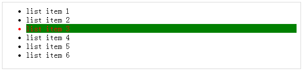

# jQuery - CSS 选择器方法

jQuery 库支持几乎所有的选择器，包括层叠样式表(CSS)，1到3，概述了在万维网联盟的网站。

使用 JQuery 库开发人员可以加强他们的网站，只要浏览器启用了 JavaScript，那么就不用担心浏览器及其版本。

大部分的 JQuery CSS 方法不修改 JQuery 对象的内容，它们用于将 CSS 属性应用到 DOM 元素中。

## 应用 CSS 属性

使用 jQuery 方法 **css( PropertyName, PropertyValue )**，那么应用任何 CSS 属性都将会非常简单。

下面是该方法的语法 ——

``` 
selector.css( PropertyName, PropertyValue );
```

这里你可以将 *PropertyName* 作为一个 JavaScript 字符串来传递并且基于它的值，*PropertyValue* 也会是一个字符串或一个整数。

### 示例

下面的例子为第二个列表项添加字体颜色。

``` 
<html>
   <head>
      <title>The jQuery Example</title>
      <script type="text/javascript" src="http://ajax.googleapis.com/ajax/libs/jquery/2.1.3/jquery.min.js"></script>
		
      <script type="text/javascript" language="javascript">
         $(document).ready(function() {
            $("li").eq(2).css("color", "red");
         });
      </script>
		
   </head>
	
   <body>
      <div>
		
         <ul>
            <li>list item 1</li>
            <li>list item 2</li>
            <li>list item 3</li>
            <li>list item 4</li>
            <li>list item 5</li>
            <li>list item 6</li>
         </ul>
			
      </div>
   </body>
	
</html>
```

这将产生如下所示结果：


## 应用多个 CSS 属性

你可以使用一个 jQuery 方法 **CSS( {key1:val1, key2:val2....)** 应用多个 CSS 属性。你可以按你的喜好，在一个调用中应用许多属性。

下面是该方法的语法 ——

``` 
selector.css( {key1:val1, key2:val2....keyN:valN})
```

这里你可以把 key 作为属性传递，并且把 val 作为值传递，如上所示。

### 示例

下面的例子中为第二个列表项添加字体颜色及背景颜色。

``` 
<html>
   <head>
      <title>The jQuery Example</title>
      <script type="text/javascript" src="http://ajax.googleapis.com/ajax/libs/jquery/2.1.3/jquery.min.js"></script>
		
      <script type="text/javascript" language="javascript">
         $(document).ready(function() {
            $("li").eq(2).css({"color":"red", "background-color":"green"});
         });
      </script>
		
   </head>
	
   <body>
      <div>
		
         <ul>
            <li>list item 1</li>
            <li>list item 2</li>
            <li>list item 3</li>
            <li>list item 4</li>
            <li>list item 5</li>
            <li>list item 6</li>
         </ul>
			
      </div>
   </body>
	
</html>
```

这将产生如下所示结果：



## 设置元素的宽和高

**width( val )** 和 **height( val )** 方法可以分别用于设置每个元素的宽和高。

### 示例

下面是一个简单的例子，设置了第一个 division 元素的宽，而其他元素的宽是由样式表设置的。

``` 
<html>
   <head>
      <title>The jQuery Example</title>
      <script type="text/javascript" src="http://ajax.googleapis.com/ajax/libs/jquery/2.1.3/jquery.min.js"></script>
		
      <script type="text/javascript" language="javascript">
         $(document).ready(function() {
            $("div:first").width(100);
            $("div:first").css("background-color", "blue");
         });
      </script>
		
      <style>
         div{ width:70px; height:50px; float:left; margin:5px; background:red; cursor:pointer; }
      </style>
		
   </head>
	
   <body>
      <div></div>
      <div>d</div>
      <div>d</div>
      <div>d</div>
      <div>d</div>
   </body>
	
</html>
```

这将产生如下所示结果：


## jQuery CSS 方法

下表列出了所有的方法，你可以使用 CSS 属性 ——

<table class="table table-bordered">
<tr>
<th>序号</th>
<th>方法 &amp; 描述</th>
</tr>
<tr>
<td>1</td>
<td><b>css( name )</b>
<p>返回第一个匹配元素的样式属性。</p></td>
</tr>
<tr>
<td>2</td>
<td><b>css( name, value )</b>
<p>在所有匹配的元素中，将一个样式属性设置为一个值。</p></td>
</tr>
<tr>
<td>3</td>
<td><b>css( properties )</b>
<p>设置一个键/值对象作为所有匹配元素的样式属性。</p></td>
</tr>
<tr>
<td>4</td>
<td><b>height( val )</b>
<p>设置每个匹配元素的 CSS 高。</p></td>
</tr>
<tr>
<td>5</td>
<td><b>height( )</b>
<p>获取当前计算的第一个匹配元素的像素，高。</p></td>
</tr>
<tr>
<td>6</td>
<td><b>innerHeight( )</b>
<p>获取第一个匹配元素的内部高(不包括边界，包括填充)。</p></td>
</tr>
<tr>
<td>7</td>
<td><b>innerWidth( )</b>
<p>获取第一个匹配元素的内部宽(不包括边界，包括填充)。</p></td>
</tr>
<tr>
<td>8</td>
<td><b>offset( )</b>
<p>获取第一个匹配元素的相对于文档的当前偏移量，以像素为单位。</p></td>
</tr>
<tr>
<td>9</td>
<td><b>offsetParent( )</b>
<p>返回一个 jQuery 集合以及第一个匹配元素的父元素的定位。</p></td>
</tr>
<tr>
<td>10</td>
<td><b>outerHeight( [margin] )</b>
<p>获取第一个匹配元素的外部高(默认包括边界和填充)。</p></td>
</tr>
<tr>
<td>11</td>
<td><b>outerWidth( [margin] )</b>
<p>获取第一个匹配元素的外部宽(默认包括边界和填充)。</p></td>
</tr>
<tr>
<td>12</td>
<td><b>position( )</b>
<p>获取一个元素相对于其父元素偏移量的顶端和左端的位置。</p></td>
</tr>
<tr>
<td>13</td>
<td><b>scrollLeft( val )</b>
<p>当传递进一个值时，所有匹配元素的滚动左偏移值就会被设置为传递进的那个值。</p></td>
</tr>
<tr>
<td>14</td>
<td><b>scrollLeft( )</b>
<p>获取第一个匹配元素的滚动左偏移值。</p></td>
</tr>
<tr>
<td>15</td>
<td><b>scrollTop( val )</b>
<p>当传递进一个值时，所有匹配元素的滚动顶偏移值就会被设置为传递进的那个值。</p></td>
</tr>
<tr>
<td>16</td>
<td><b>scrollTop( )</b>
<p>获取第一个匹配元素的滚动顶偏移值。</p></td>
</tr>
<tr>
<td>17</td>
<td><b>width( val )</b>
<p>为每个匹配元素设置 CSS 宽。</p></td>
</tr>
<tr>
<td>18</td>
<td><b>width( )</b>
<p>获取当前可计算的第一个匹配元素的宽，以像素为单位。</p></td>
</tr>
</table>

