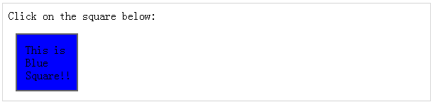
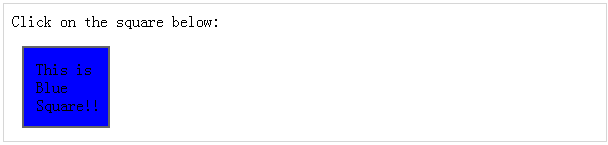
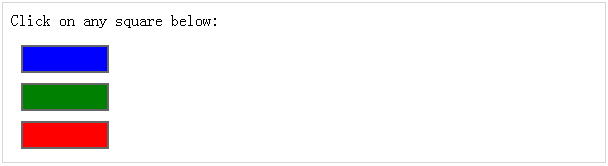

# jQuery - DOM 操作

JQuery 提供了一些方法来有效的操纵 DOM。你不需要编写冗长的代码来修改任何元素的属性值或从段落或 division 中提取 HTML 代码。

JQuery 提供的方法如 .attr()，.html() 和 .val，充当 getter，从 DOM 元素中检索信息，供以后使用。

## 内容操作

**html( )** 方法获取第一个匹配元素的 html 内容(内部 HTML)。

这是该方法的语法 ——

``` 
selector.html( )
```

### 示例

下面是一个例子，利用 .html() 和 .text(val) 方法。这里，.html()对象检索来自对象的 HTML 内容，然后 .text(val) 方法使用传递的参数设置对象的值 ——

``` 
<html>
   <head>
      <title>The jQuery Example</title>
      <script type="text/javascript" src="http://ajax.googleapis.com/ajax/libs/jquery/2.1.3/jquery.min.js"></script>
		
      <script type="text/javascript" language="javascript">
         $(document).ready(function() {
            $("div").click(function () {
               var content = $(this).html();
               $("#result").text( content );
            });
         });
      </script>
		
      <style>
         #division{ margin:10px;padding:12px; border:2px solid #666; width:60px;}
      </style>
		
   </head>
	
   <body>
	
      <p>Click on the square below:</p>
      <span id="result"> </span>
		
      <div id="division" style="background-color:blue;">
         This is Blue Square!!
      </div>
		
   </body>
	
</html>
```

这将产生如下所示结果：



## DOM 元素替换

你可以使用指定的 HTML 或 DOM 元素来替换一个完整的 DOM 元素。**replaceWith( content )** 方法很符合这一目的。

这是该方法的语法 ——

``` 
selector.replaceWith( content )
```

这里 concent 是你想要替换原始元素的东西。这可以是 HTML 或简单的文本。

### 示例

下面的例子中用 "< h1>JQuery is Great< /h1>" 替换了 division 元素 ——

``` 
<html>
   <head>
      <title>The jQuery Example</title>
      <script type="text/javascript" src="http://ajax.googleapis.com/ajax/libs/jquery/2.1.3/jquery.min.js"></script>
		
      <script type="text/javascript" language="javascript">
         $(document).ready(function() {
            $("div").click(function () {
               $(this).replaceWith("<h1>JQuery is Great</h1>");
            });
         });
      </script>
		
      <style>
         #division{ margin:10px;padding:12px; border:2px solid #666; width:60px;}
      </style>
		
   </head>
	
   <body>
	
      <p>Click on the square below:</p>
      <span id="result"> </span>
		
      <div id="division" style="background-color:blue;">
         This is Blue Square!!
      </div>
		
   </body>
</html>
```

这将产生如下所示结果：



## 删除 DOM 元素

你可能会想要从文档中删除一个或多个 DOM 元素。jQuery 提供了两种方法来实现这一操作。

**empty()** 方法会从一组匹配的元素中删除所有的子节点，而 **remove(expr)** 方法会从 DOM 中删除所有的匹配元素。

这是两种方法的语法 ——

``` 
selector.remove( [ expr ])

or 

selector.empty( )
```

你可以传递可选参数 *expr* 来过滤要被删除的元素组。

### 示例

下面的例子中当元素被点击时，就会被删除 ——

``` 
<html>
   <head>
      <title>The jQuery Example</title>
      <script type="text/javascript" src="http://ajax.googleapis.com/ajax/libs/jquery/2.1.3/jquery.min.js"></script>
		
      <script type="text/javascript" language="javascript">
         $(document).ready(function() {
            $("div").click(function () {
               $(this).remove( );
            });
         });
      </script>
		
      <style>
         .div{ margin:10px;padding:12px; border:2px solid #666; width:60px;}
      </style>
		
   </head>
	
   <body>
	
      <p>Click on any square below:</p>
      <span id="result"> </span>
		
      <div class="div" style="background-color:blue;"></div>
      <div class="div" style="background-color:green;"></div>
      <div class="div" style="background-color:red;"></div>
		
   </body>
	
</html>
```

这将产生如下所示结果：



## 插入 DOM 元素

你可能会想要在已存在的文档中插入一个或多个新的 DOM 元素。jQuery 提供了不同的方法来在不同的位置插入元素。

**after( content )** 方法会在每个匹配元素之后插入内容，而 **before( content )** 方法会在每个匹配元素之前插入内容。

这是两种方法的语法 ——

``` 
selector.after( content )

or

selector.before( content )
```

这里 content 是你想要插入的内容。它可以是 HTML 或简单的文本。

### 示例

下述例子中会在点击的元素之前插入 < div> 元素 ——

``` 
<html>
   <head>
      <title>The jQuery Example</title>
      <script type="text/javascript" src="http://ajax.googleapis.com/ajax/libs/jquery/2.1.3/jquery.min.js"></script>
		
      <script type="text/javascript" language="javascript">
         $(document).ready(function() {
            $("div").click(function () {
               $(this).before('<div class="div"></div>' );
            });
         });
      </script>
		
      <style>
         .div{ margin:10px;padding:12px; border:2px solid #666; width:60px;}
      </style>
		
   </head>
	
   <body>
	
      <p>Click on any square below:</p>
      <span id="result"> </span>
		
      <div class="div" style="background-color:blue;"></div>
      <div class="div" style="background-color:green;"></div>
      <div class="div" style="background-color:red;"></div>
		
   </body>
	
</html>
```

这将产生如下所示结果：


## DOM 操作方法

下表是用来操作 DOM 元素的全部方法 ——

<table class="table table-bordered">
<tr>
<th>序号</th>
<th>方法 &amp; 描述</th>
</tr>
<tr>
<td>1</td>
<td><b>after( content )</b>
<p>在每一个匹配元素之后插入内容</p></td>
</tr>
<tr>
<td>2</td>
<td>
<b>append( content )</b>
<p>在每一个匹配元素内部添加内容。</p></td>
</tr>
<tr>
<td>3</td>
<td><b>appendTo( selector )</b>
<p>将所有匹配元素添加到另一个指定的元素组中。</p></td>
</tr>
<tr>
<td>4</td>
<td><b>before( content )</b>
<p>在每个匹配的元素之前插入内容。</p></td>
</tr>
<tr>
<td>5</td>
<td><b>clone( bool )</b>
<p>克隆匹配的 DOM 元素以及所有的事件处理程序，并选择克隆项。</p></td>
</tr>
<tr>
<td>6</td>
<td><b>clone( )</b>
<p>克隆匹配的 DOM 元素并选择克隆项。</p></td>
</tr>
<tr>
<td>7</td>
<td><b>empty( )</b>
<p>从匹配的元素集合中删除所有的孩子节点。</p></td>
</tr>
<tr>
<td>8</td>
<td><b>html( val )</b>
<p>设置每个匹配元素的 html 内容。</p></td>
</tr>
<tr>
<td>9</td>
<td><b>html( )</b>
<p>获取第一个匹配元素的 html 内容(内部 HTML)。</p></td>
</tr>
<tr>
<td>10</td>
<td><b>insertAfter( selector )</b>
<p>将所有的匹配元素插入到另一个指定的元素集合之后。</p></td>
</tr>
<tr>
<td>11</td>
<td><b>insertBefore( selector )</b>
<p>将所有匹配的元素插入到另一个指定的元素集合之前。</p></td>
</tr>
<tr>
<td>12</td>
<td><b>prepend( content )</b>
<p>将内容前置到每个匹配元素的内部。</p></td>
</tr>
<tr>
<td>13</td>
<td><b>prependTo( selector )</b>
<p>将所有匹配元素前置到另一个指定的元素集合中。</p></td>
</tr>
<tr>
<td>14</td>
<td><b>remove( expr )</b>
<p>从 DOM 中删除所有的匹配元素。</p></td>
</tr>
<tr>
<td>15</td>
<td><b>replaceAll( selector )</b>
<p>用匹配的元素替换与指定的选择器相匹配的元素。</p> </td>
</tr>
<tr>
<td>16</td>
<td><b>replaceWith( content )</b>
<p>用指定的 HTML 或 DOM 元素代替所有的匹配元素。</p></td>
</tr>
<tr>
<td>17</td>
<td><b>text( val )</b>
<p>设置所有匹配元素的文本内容。</p></td>
</tr>
<tr>
<td>18</td>
<td><b>text( )</b>
<p>获取所有匹配元素的组合的文本内容。</p></td>
</tr>
<tr>
<td>19</td>
<td><b>wrap( elem )</b>
<p>用指定的元素包装每个匹配的元素。</p></td>
</tr>
<tr>
<td>20</td>
<td><b>wrap( html )</b>
<p>用指定的 HTML 内容包装每个匹配的元素。</p></td>
</tr>
<tr>
<td>21</td>
<td><b>wrapAll( elem )</b>
<p>将匹配的集合中的全部元素包装到一个单独的元素中。</p></td>
</tr>
<tr>
<td>22</td>
<td><b>wrapAll( html )</b>
<p>将匹配的集合中的全部元素包装到一个单独的元素中。</p></td>
</tr>
<tr>
<td>23</td>
<td><b>wrapInner( elem )</b>
<p>用 DOM 元素包装每个匹配元素(包括文本节点)的内部孩子内容。</p></td>
</tr>
<tr>
<td>24</td>
<td><b>wrapInner( html )</b>
<p>用 HTML 结构包装每个匹配元素(包括文本节点)的内部孩子内容。</p></td>
</tr>
</table>