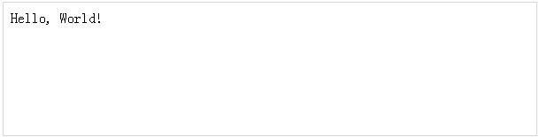
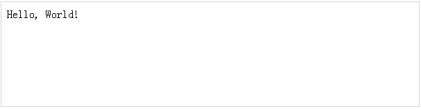
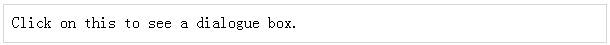

# jQuery - 概述

## 什么是 jQuery？

jQuery 是一种快速简洁的 JavaScript 库，由 John Resig 在 2006 年创建，它的理念很好——**用更少的代码，实现更多的功能**。

jQuery 简化了 HTML 文档遍历、事件处理、动画以及 Ajax 交互，用于快速 web 开发。

jQuery 是一个 JavaScript 工具包，旨在通过编写更少的代码来简化各种任务。这是 jQuery 支持的重要的核心特性列表 ——

- **DOM 操作 ——** jQuery 通过使用被称为 **Sizzle** 的跨浏览器的开源选择器引擎，使得选择 DOM 元素，遍历它们以及修改它们的内容变得容易。

- **事件处理 ——** jQuery 提供一种优雅的方式来捕获各种事件，如用户点击一个链接，不需要使用事件处理程序来编写杂乱的 HTML 代码。

- **AJAX 支持 ——** jQuery 能够为你使用 AJAX 技术开发响应的和功能丰富的网站提供很多帮助。

- **动画 ——** jQuery 有很多内置的动画效果，你可以在你的网站中使用它们。

- **轻量级 ——** jQuery 是非常轻量级的库 —— 大约 19 kb 大小(压缩格式)。

- **跨浏览器支持 ——** jQuery 跨浏览器支持，可以在 IE 6.0 +，FF 2.0 +，Safari 3.0 +，Chrome，Opera 9.0 + 浏览器上很好的工作。

- **最新的技术 ——** jQuery 支持 CSS3 选择器和基本的 XPath 语法。

## 如何使用 jQuery ？

有两种方式来使用 jQuery。

- **本地安装 ——** 你可以在本地计算机上下载 jQuery 库，并把它包括在你的 HTML 代码中。

- **基于 CDN 版本 ——** 你可以直接从内容分发网络(CDN)将 jQuery 库包括进你的 HTML 代码中。

## 本地安装

- 进入 [https://jquery.com/download/](https://jquery.com/download/) 网页来下载最新的可用的版本。

- 现在下载 **jquery-2.1.3.min.js** 文件到你的网站目录中，如 /jquery。

### 示例

现在你可以把 *jQuery* 库包括进你的 HTML 文件中，如下所示 ——

``` 
<html>
   <head>
      <title>The jQuery Example</title>
      <script type="text/javascript"  src="/jquery/jquery-2.1.3.min.js"></script>
		
      <script type="text/javascript">
         $(document).ready(function(){
            document.write("Hello, World!");
         });
      </script>
		
   </head>
	
   <body>

      <h1>Hello</h1>

   </body>
</html>
```

这将产生如下所示结果 ——



## 基于CDN版本

你可以直接从内容分发网络(CDN)将 jQuery 库包括进你的 HTML 代码中。谷歌和微软为最新的版本提供了内容发布。

>在本教程中，我们使用的是 Google CDN 版本库。

### 示例

现在让我们使用来自 Google CDN 的 jQuery 库重新编写上述例子。

``` 
<html>
   <head>
      <title>The jQuery Example</title>
      <script type="text/javascript" src="http://ajax.googleapis.com/ajax/libs/jquery/2.1.3/jquery.min.js">
      </script>
		
      <script type="text/javascript">
         $(document).ready(function(){
            document.write("Hello, World!");
         });
      </script>
   </head>
	
   <body>

      <h1>Hello</h1>

   </body>
</html>
```

这会产生如下所示的结果 ——



## 如何调用一个 jQuery 库函数？

正如我们所做的任何事一样，在使用 jQuery 读取或操作文档对象模型(DOM)，我们需要确保当 DOM 准备好后要尽快的开始添加事件等。

如果你想使一个事件在你的页面上工作，你应该在 $(document).ready() 函数内部调用它。在 DOM 下载完成后以及页面内容下载前，该函数内部的所有事物都将要下载。

要想实现这一功能功能，我们为文档注册了一个已经准备好的事件，如下所示 ——

``` 
$(document).ready(function() {
   // do stuff when DOM is ready
});
```

要想调用上述任何 jQuery 库函数，使用 HTML 脚本标签，如下所示 ——

``` 
<html>
   <head>
      <title>The jQuery Example</title>
      <script type="text/javascript" src="http://ajax.googleapis.com/ajax/libs/jquery/2.1.3/jquery.min.js">
      </script>

      <script type="text/javascript" language="javascript">
         $(document).ready(function() {
            $("div").click(function() {alert("Hello, world!");});
         });
      </script>

   </head>
	
   <body>
      <div id="mydiv">
         Click on this to see a dialogue box.
      </div>
   </body>
	
</html>
``` 

这将产生如下所示结果 ——


## 如何使用自定义脚本？

最好在自定义的 JavaScript 文件：**custom.js** 中编写我们的自定义代码，如下所示 ——

``` 
/* Filename: custom.js */
$(document).ready(function() {
   $("div").click(function() {
      alert("Hello, world!");
   });
});
```

现在我们可以把 **custom.js** 文件包括到 HTML 文件中，如下所示 ——

``` 
<html>
   <head>
      <title>The jQuery Example</title>
      <script type="text/javascript" src="http://ajax.googleapis.com/ajax/libs/jquery/2.1.3/jquery.min.js">
      </script>
		
      <script type="text/javascript" src="/jquery/custom.js"></script>
   </head>
	
   <body>
      <div id="mydiv">
         Click on this to see a dialogue box.
      </div>
   </body>
	
</html>
``` 

这将产生如下所示结果 ——



## 使用多个库 ——

你可以同时使用多个库而且每个库之间不会发生冲突。例如你可以同时使用 jQuery 和 MooTool javascript 库。

更多细节，你可以查看 [**jQuery noConflict**](http://www.tutorialspoint.com/jquery/jquery-noconflict.htm) 方法。

## 接下来的内容

即使你对上述示例不是很理解的话，也不要太担心。在随后的章节中，你会很快掌握它们。

下一节将讲解一些传统的 JavaScript 的基本概念。
