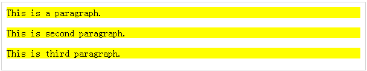

# jQuery - 选择器

jQuery 库利用级联样式表(CSS)选择器让我们快速而方便地访问文档对象模型(DOM)中的元素或元素组。

jQuery 选择器是一个函数，基于给定的标准，利用表达式从 DOM 中找出匹配的元素。简单来说，选择器是使用 jQuery 来选择一个或多个 HTML 元素。当一个元素被选中，然后我们对所选元素可以执行各种操作。

## $() 工厂函数

jQuery 选择器以 dollar 符号和括号开始 —— $()。工厂函数 $() 使用了以下三个部分来从给定的文档中选取元素 ——

<table class="table table-bordered">
<tr>
<th>序号</th>
<th>选择器 &amp; 描述</th>
</tr>
<tr>
<td>1</td>
<td>
<b>标签名</b>
<p>代表在 DOM 中可用的标签名。例如 <b>$('p')</b> 选择文档中所有的段落 &lt;p&gt;。 </p></td>
</tr>
<tr>
<td>2</td>
<td>
<b>标签 ID</b>
<p>代表在 DOM 中带有给定 ID 的一个可用的标签。例如 <b>$('#some-id')</b> 选择文档中带有 ID 为 some-id 的单个元素。</p>
</td>
</tr>
<tr>
<td>3</td>
<td>
<b>标签类</b>
<p>代表在 DOM 中带有指定类的可用的标签。例如 <b>$('.some-class')</b> 选择文档中带有 some-class 类的所有元素。</p></td>
</tr>
</table>

上述所有项目可以单个使用或结合其他的选择器使用。所有 jQuery 选择器除了一些调整外，都是基于同样的原则。

**注意 ——** 工厂函数 **$()** 是 **jQuery()** 函数的同义词。所以如果你使用的是任何其他 JavaScript 库，其中 **$** 符号和一些其他的事情有冲突的话，你可以用 jQuery 名称来取代 **$** 符号，并且你也可以使用 **jQuery()** 函数来替代 **$()** 函数。

### 示例

下面是使用标签选择器的一个简单的例子。它会选取带有标签名称 **p** 的全部的元素，并把它们的背景色设置为 “黄色”。

``` 
<html>
   <head>
      <title>The jQuery Example</title>
      <script type="text/javascript" src="http://ajax.googleapis.com/ajax/libs/jquery/2.1.3/jquery.min.js">
      </script>

      <script type="text/javascript" language="javascript">
         $(document).ready(function() {
            $("p").css("background-color", "yellow");
         });
      </script>
   </head>
	
   <body>
      <div>
         <p class="myclass">This is a paragraph.</p>
         <p id="myid">This is second paragraph.</p>
         <p>This is third paragraph.</p>
      </div>
   </body>
	
</html>
``` 

这将产生如下所示结果 ——



## 如何使用选择器？

选择器非常有用，在使用 jQuery 的每一步都需要使用选择器。它们会从 HTML 文档中获得你想要的正确的元素。

下表列出了一些基本的选择器并用示例进行了解释。

<table class="table table-bordered">
<tr>
<th>序号</th>
<th>选择器 &amp; 描述</th>
</tr>
<tr>
<td>1</td>
<td>
<b>名称</b>
<p>选择出与给定的元素 <b>Name</b> 匹配的所有元素。</p></td>
</tr>
<tr>
<td>2</td>
<td><b>#ID</b>
<p>选择出与给定的 <b>ID</b> 相匹配的单个元素。</p></td>
</tr>
<tr>
<td>3</td>
<td><b>.Class</b>
<p>选择出与给定的 <b>Class</b> 匹配的全部元素。</p></td>
</tr>
<tr>
<td>4</td>
<td><b>Universal (*)</b>
<p>选择出在 DOM 中全部可用的元素。</p></td>
</tr>
<tr>
<td>5</td>
<td><b>多个元素 E, F, G</b>
<p>选择出所有指定的选择器 <b>E, F</b> 或 <b>G</b> 的所有组合结果。</p></td>
</tr>
</table>

## 选择器示例

与上述语法和实例类似，下面的例子会使你对使用其他类型的选择器有一个大致的了解 ——

<table class="table table-bordered">
<tr>
<th>S.N.</th>
<th>Selector &amp; Description</th>
</tr>
<tr>
<td>1</td>
<td><b>$('*')</b>
<p>该选择器选出文档中所有的元素。</p></td>
</tr>
<tr>
<td>2</td>
<td><b>$("p &gt; *")</b>
<p>该选择器选择出段落元素的所有子元素。</p></td>
</tr>
<tr>
<td>3</td>
<td><b>$("#specialID")</b>
<p>该选择器函数获取 id="specialID" 的元素。</p></td>
</tr>
<tr>
<td>4</td>
<td><b>$(".specialClass")</b>
<p>该选择器获取带有 <i>specialClass</i> 类的所有元素。</p></td>
</tr>
<tr>
<td>5</td>
<td><b>$("li:not(.myclass)")</b>
<p>选择出与 &lt;li&gt; 匹配并且不带有 class="myclass" 类的所有元素。</p></td>
</tr>
<tr>
<td>6</td>
<td><b>$("a#specialID.specialClass")</b>
<p>该选择器与 id 为 <i>specialID</i> 的链接匹配并且带有 <i>specialClass</i> 类。</p></td>
</tr>
<tr>
<td>7</td>
<td><b>$("p a.specialClass")</b>
<p>该选择器与带有 <i>specialClass</i> 类的链接匹配并且该类在 &lt;p&gt; 元素内声明。</p></td>
</tr>
<tr>
<td>8</td>
<td><b>$("ul li:first")</b>
<p>该选择器获取 &lt;ul&gt; 的第一个 &lt;li&gt; 元素。</p></td>
</tr>
<tr>
<td>9</td>
<td><b>$("#container p")</b>
<p>选择与 &lt;p&gt; 匹配并且是带有 <i>container</i> id 元素的后代的全部元素。</p></td>
</tr>
<tr>
<td>10</td>
<td><b>$("li &gt; ul")</b>
<p>选择与 &lt;ul&gt; 匹配并且是与 &lt;li&gt; 匹配的元素的孩子的全部元素。</p></td>
</tr>
<tr>
<td>11</td>
<td><b>$("strong + em")</b>
<p>选择与 &lt;em&gt; 匹配并且紧跟一个与 &lt;strong&gt; 匹配的兄弟元素的全部元素。</p></td>
</tr>
<tr>
<td>12</td>
<td><b>$("p ~ ul")</b>
<p>选择与 &lt;ul&gt; 匹配并且后面有一个与 &lt;p&gt; 匹配的兄弟元素的全部元素。</p></td>
</tr>
<tr>
<td>13</td>
<td><b>$("code, em, strong")</b>
<p>选择所有与 &lt;code&gt; 或 &lt;em&gt; 或 &lt;strong&gt; 匹配的元素。</p></td>
</tr>
<tr>
<td>14</td>
<td><b>$("p strong, .myclass")</b>
<p>选择与 &lt;strong&gt; 匹配并且是与 &lt;p&gt 匹配的元素的后代，同样所有的元素都要有 <i>myclass</i> 类的全部元素。</p></td>
</tr>
<tr>
<td>15</td>
<td><b>$(":empty")</b>
<p>选择出所有没有孩子的元素。</p></td>
</tr>
<tr>
<td>16</td>
<td><b>$("p:empty")</b>
<p>选择出所有与 &lt;p&gt; 匹配并且没有孩子的元素。</p></td>
</tr>
<tr>
<td>17</td>
<td><b>$("div[p]")</b>
<p>选择出与 &lt;div&gt; 匹配并且包含一个与 &lt;p&gt; 匹配的元素的所有元素。</p></td>
</tr>
<tr>
<td>18</td>
<td><b>$("p[.myclass]")</b>
<p>选择出与 &lt;p&gt; 匹配并且包含一个带有 <i>myclass</i> 类的元素的所有元素。</p></td>
</tr>
<tr>
<td>19</td>
<td><b>$("a[@rel]")</b>
<p>选择出与 &lt;a&gt; 匹配并且带有 rel 属性的全部元素。</p></td>
</tr>
<tr>
<td>20</td>
<td><b>$("input[@name=myname]")</b>
<p>选择出所有与 &lt;input&gt; 匹配并且 name 值恰好等于 <i>myname 的元素。</i></p></td>
</tr>
<tr>
<td>21</td>
<td><b>$("input[@name^=myname]")</b>
<p>选择出所有与 &lt;input&gt; 匹配并且 name 值以 <i>myname</i> 开始的元素。</p></td>
</tr>
<tr>
<td>22</td>
<td><b>$("a[@rel$=self]")</b>
<p>选择出所有与 &lt;a&gt; 匹配并且带有以 <i>self</i> 结尾的 <b>rel</b> 属性值的元素。</p></td>
</tr>
<tr>
<td>23</td>
<td><b>$("a[@href*=domain.com]")</b>
<p>选择出所有与 &lt;a&gt; 并且带有一个包含 domain.com 的超链接值的元素。</p></td>
</tr>
<tr>
<td>24</td>
<td><b>$("li:even")</b>
<p>选择出与 &lt;li&gt; 匹配并且带有一个 even 索引值的全部元素。</p></td>
</tr>
<tr>
<td>25</td>
<td><b>$("tr:odd")</b>
<p>选择出与 &lt;tr&gt; 匹配并且有 odd 索引值的全部元素。</p></td>
</tr>
<tr>
<td>26</td>
<td><b>$("li:first")</b>
<p>选择出第一个 &lt;li&gt; 元素。</p></td>
</tr>
<tr>
<td>27</td>
<td><b>$("li:last")</b>
<p>选择出最后一个  &lt;li&gt; 元素。</p></td>
</tr>
<tr>
<td>28</td>
<td><b>$("li:visible")</b>
<p>选择出与 &lt;li&gt; 匹配并且可见的全部元素。</p></td>
</tr>
<tr>
<td>29</td>
<td><b>$("li:hidden")</b>
<p>选择出与 &lt;li&gt; 匹配并且不可见的全部元素。</p></td>
</tr>
<tr>
<td>30</td>
<td><b>$(":radio")</b>
<p>选择出表单中全部的单选按钮。</p></td>
</tr>
<tr>
<td>31</td>
<td><b>$(":checked")</b>
<p>选择出表单中全部的复选框。</p></td>
</tr>
<tr>
<td>32</td>
<td><b>$(":input")</b>
<p>只选择表单元素 (输入，选择，文本区，按钮)。</p></td>
</tr>
<tr>
<td>33</td>
<td><b>$(":text")</b>
<p>只选择文本元素 (input[type=text])。</p></td>
</tr>
<tr>
<td>34</td>
<td><b>$("li:eq(2)")</b>
<p>选择第三个 &lt;li&gt; 元素。</p></td>
</tr>
<tr>
<td>35</td>
<td><b>$("li:eq(4)")</b>
<p>选择第五个 &lt;li&gt; 元素。</p></td>
</tr>
<tr>
<td>36</td>
<td><b>$("li:lt(2)")</b>
<p>选择第三个之前的与 &lt;li&gt; 元素匹配的所有元素；换句话说，也就说前两个 &lt;li&gt; 元素。</p></td>
</tr>
<tr>
<td>37</td>
<td><b>$("p:lt(3)")</b>
<p>选择第四个之前的与 &lt;p&gt; 元素匹配的全部元素；换句话说，也就是前三个 &lt;p&gt; 元素。</p></td>
</tr>
<tr>
<td>38</td>
<td><b>$("li:gt(1)")</b>
<p>选择第二个之后的与 &lt;li&gt; 匹配的全部元素。</p></td>
</tr>
<tr>
<td>39</td>
<td><b>$("p:gt(2)")</b>
<p>选择第三个之后与 &lt;p&gt; 匹配的全部元素。</p></td>
</tr>
<tr>
<td>40</td>
<td><b>$("div/p")</b>
<p>选择与 &lt;p&gt; 匹配并且是与 &lt;div&gt; 匹配的元素的孩子的全部元素。</p></td>
</tr>
<tr>
<td>41</td>
<td><b>$("div//code")</b>
<p>选择与 &lt;code&gt; 匹配并且是与 &lt;div&gt; 匹配的元素的后代的全部元素。</p></td>
</tr>
<tr>
<td>42</td>
<td><b>$("//p//a")</b>
<p>选择与 &lt;a&gt; 匹配并且是与 &lt;p&gt; 匹配的元素后代的全部元素。</p></td>
</tr>
<tr>
<td>43</td>
<td><b>$("li:first-child")</b>
<p>选择与 &lt;li&gt; 匹配并且是它们父亲的第一个孩子的全部元素。</p></td>
</tr>
<tr>
<td>44</td>
<td><b>$("li:last-child")</b>
<p>选择与 &lt;li&gt; 匹配并且是它们父亲的最后一个孩子的全部元素。</p></td>
</tr>
<tr>
<td>45</td>
<td><b>$(":parent")</b>
<p>选择出是另一个元素的父亲的全部元素，包括文本。</p></td>
</tr>
<tr>
<td>46</td>
<td><b>$("li:contains(second)")</b>
<p>选择与 &lt;li&gt; 匹配并且包含文本 second 的全部元素。</p></td></tr>
</table>

你可以用任何 HTML/XML 元素以通用的方式使用上述所有选择器。例如，如果选择器 **$("li:first")** 为 < li> 元素工作，那么 **$("p:first")** 也会为 < p> 元素工作。


