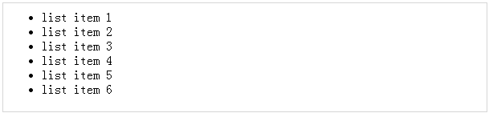
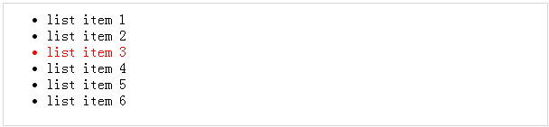
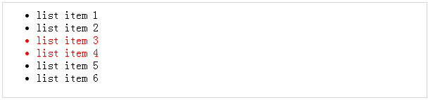
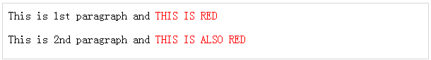

# jQuery - DOM 遍历

jQuery 是一个非常强大的工具，提供了各种各样的 DOM 遍历方法来帮助我们在文档中以随机的连续的方式选择元素。

大部分的 DOM 遍历方法不修改 jQuery 对象，它们是用于从一个基于给定条件的文档中过滤元素的。

## 通过索引找到元素 ——

考虑一个简单的文档，带有下述 HTML 内容 ——

``` 
<html>
   <head>
      <title>The JQuery Example</title>
   </head>
	
   <body>
	
      <div>
         <ul>
            <li>list item 1</li>
            <li>list item 2</li>
            <li>list item 3</li>
            <li>list item 4</li>
            <li>list item 5</li>
            <li>list item 6</li>
         </ul>
      </div>
		
   </body>
	
</html>
```

这将产生如下所示结果 ——



- 上述每个列表都有自己的索引，并且通过使用如下所示的例子中的 **eq(index)** 方法直接定位。

- 每个子元素的索引都是从 0 开始，因此，*list item 2* 可以通过使用 **$("li").eq(1)** 来访问，等等。

### 示例

下述是一个简单的例子，为第二个 list item 添加颜色。

``` 
<html>
   <head>
      <title>The JQuery Example</title>
      <script type="text/javascript" src="http://ajax.googleapis.com/ajax/libs/jquery/2.1.3/jquery.min.js">
      </script>
		
      <script type="text/javascript" language="javascript">
         $(document).ready(function() {
            $("li").eq(2).addClass("selected");
         });
      </script>
		
      <style>
         .selected { color:red; }
      </style>
		
   </head>
	
   <body>
	
      <div>
         <ul>
            <li>list item 1</li>
            <li>list item 2</li>
            <li>list item 3</li>
            <li>list item 4</li>
            <li>list item 5</li>
            <li>list item 6</li>
         </ul>
      </div>
		
   </body>
</html>
```

这将产生如下所示的结果 ——



## 过滤元素

过滤器(选择器)方法可以用来从匹配的元素集合中过滤掉与指定的选择器不匹配的所有元素。*选择器*可以使用任何选择器的语法来编写。

### 示例

下述是一个简单的例子，将颜色应用到与 middle 类关联的列表中 ——

``` 
<html>
   <head>
      <title>The JQuery Example</title>
      <script type="text/javascript" src="http://ajax.googleapis.com/ajax/libs/jquery/2.1.3/jquery.min.js">
      </script>
		
      <script type="text/javascript" language="javascript">
         $(document).ready(function() {
            $("li").filter(".middle").addClass("selected");
         });
      </script>
		
      <style>
         .selected { color:red; }
      </style>
		
   </head>
	
   <body>
	
      <div>
         <ul>
            <li class="top">list item 1</li>
            <li class="top">list item 2</li>
            <li class="middle">list item 3</li>
            <li class="middle">list item 4</li>
            <li class="bottom">list item 5</li>
            <li class="bottom">list item 6</li>
         </ul>
      </div>
		
   </body>
</html>
``` 

这将产生如下所示结果 ——



## 定位后代元素

find (选择器)方法可以用于定位某一特定类型元素的所有后代元素。*选择器*可以通过使用任何选择器的语法来编写。

### 示例

下面的例子中选取了在不同的 < p> 元素内部所有可用的 < span>元素 ——

``` 
<html>
   <head>
      <title>The JQuery Example</title>
      <script type="text/javascript" src="http://ajax.googleapis.com/ajax/libs/jquery/2.1.3/jquery.min.js">
      </script>
		
      <script type="text/javascript" language="javascript">
         $(document).ready(function() {
            $("p").find("span").addClass("selected");
         });
      </script>
		
      <style>
         .selected { color:red; }
      </style>
		
   </head>
	
   <body>
      <p>This is 1st paragraph and <span>THIS IS RED</span></p>
      <p>This is 2nd paragraph and <span>THIS IS ALSO RED</span></p>
   </body>
	
</html>
```

这将产生如下所示结果 ——



## jQuery DOM 过滤方法

下表列出了有用的方法，你可以用它来从 DOM 元素列表中过滤掉各种元素 ——

<table class="table table-bordered">
<tr>
<th>序号</th>
<th>方法 &amp; 描述</th>
</tr>
<tr>
<td>1</td>
<td><b>eq( index )</b>
<p>将一个匹配的元素集合减小为一个单个的元素。</p></td>
</tr>
<tr>
<td>2</td>
<td><b>filter( selector )</b>
<p>从匹配的元素集合中删除与指定的选择器不匹配的元素。</p></td>
</tr>
<tr>
<td>3</td>
<td><b>filter( fn )</b>
<p>从匹配的元素集合中删除与指定的函数不匹配的元素。</p></td>
</tr>
<tr>
<td>4</td>
<td><b>is( selector )</b>
<p>检查表达式的当前选择，如果选项中至少有一个元素符合给定的选择器，那么返回 true。</p></td>
</tr>
<tr>
<td>5</td>
<td><b>map( callback )</b>
<p>将 jQuery 对象中的一组元素转换成 jQuery 数组中的另一组值(该数组可能包含也可能不包含元素)。</p></td>
</tr>
<tr>
<td>6</td>
<td><b>not( selector )</b>
<p>从可匹配元素的集合中删除与指定的选择器相匹配的元素。</p></td>
</tr>
<tr>
<td>7</td>
<td><b>slice( start, [end] )</b>
<p>选取可匹配元素的子集。</p></td>
</tr>
</table>

## JQuery DOM 遍历方法

下表列出了其他有用的方法，你可以在 DOM 中使用，用于定位各种元素 ——

<table class="table table-bordered">
<tr>
<th>序号</th>
<th>方法 &amp; 描述</th>
</tr>
<tr>
<td>1</td>
<td><b>add( selector )</b>
<p>在匹配的元素集合中添加更多的与给定的选择器相匹配的元素。</p></td>
</tr>
<tr>
<td>2</td>
<td><b>andSelf( )</b></p>
<p>将先前的选择添加到当前的选择中。</p></td>
</tr>
<tr>
<td>3</td>
<td><b>children( [selector])</b>
<p>获取一个元素集合，包含每个可匹配元素集合的唯一的直接的全部孩子元素。</p></td>
</tr>
<tr>
<td>4</td>
<td><b>closest( selector )</b>
<p>获取一个元素集合，包含与指定的选择器相匹配的最近的父亲元素，包括起始元素。</p></td>
</tr>
<tr>
<td>5</td>
<td><b>contents( )</b>
<p>在匹配的元素(包括文本节点)中找到所有的孩子节点，如果元素是一个 iframe，那么在内容文档中找到所有的孩子节点。</p></td>
</tr>
<tr>
<td>6</td>
<td><b>end( )</b>
<p>恢复最近的'破坏性'操作，将匹配的元素集合设置为它之前的状态。</p></td>
</tr>
<tr>
<td>7</td>
<td><b>find( selector )</b>
<p>搜索与指定的选择器匹配的后代元素。</p></td>
</tr>
<tr>
<td>8</td>
<td><b>next( [selector] )</b>
<p>获取一个元素集合，包含给定元素集合的唯一的下一个兄弟元素。</p></td>
</tr>
<tr>
<td>9</td>
<td><b>nextAll( [selector] )</b>
<p>找到当前元素之后的所有兄弟元素。</p></td>
</tr>
<tr>
<td>10</td>
<td><b>offsetParent( )</b>
<p>返回一个 jQuery 集合以及第一个匹配元素的父亲的定位。</p></td>
</tr>
<tr>
<td>11</td>
<td><b>parent( [selector] )</b>
<p>获取一个元素的直接父亲。如果在一组元素中调用，父元素会返回一组它们唯一直接父亲元素的集合。</p></td>
</tr>
<tr>
<td>12</td>
<td><b>parents( [selector] )</b>
<p>得到一个元素集合，包含匹配元素集合的唯一的祖先元素(根元素除外)。</p></td>
</tr>
<tr>
<td>13</td>
<td><b>prev( [selector] )</b>
<p>得到一个元素集合，包含匹配元素集合的唯一的先前的兄弟元素。</p></td>
</tr>
<tr>
<td>14</td>
<td><b>prevAll( [selector] )</b>
<p>找到当前元素之前的所有兄弟元素。</p></td>
</tr>
<tr>
<td>15</td>
<td><b>siblings( [selector] )</b>
<p>获取一个元素集合，包含每个可匹配元素集合的全部唯一的兄弟元素。</p></td>
</tr>
</table>


